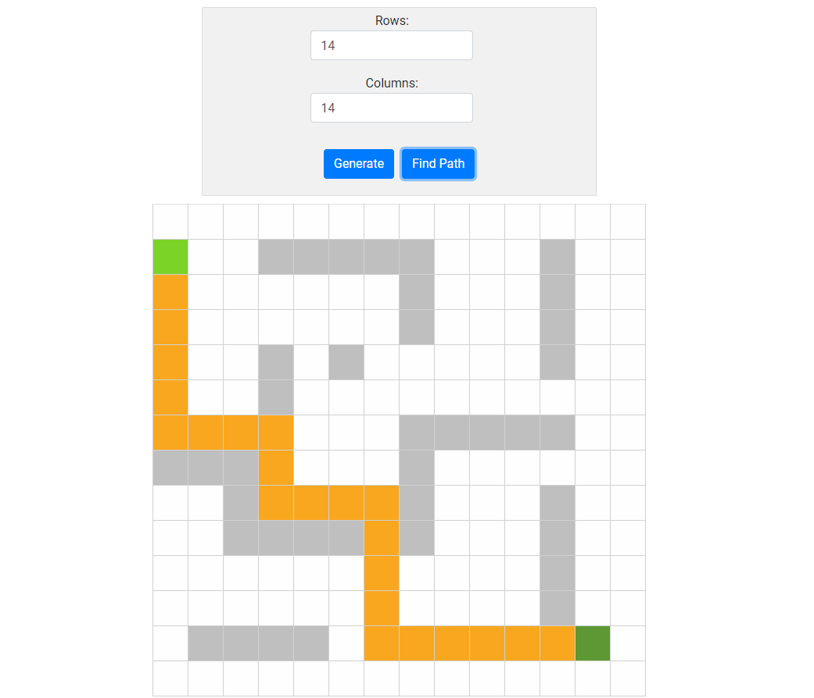

# Path Finding App
A path finding app created with React.js and Redux based on breadth first search algorithm in a grid based environment.

Screenshot:


### Installation

Clone the repository and open your terminal.
Make your current working directory todo-app-react-redux.

Make sure you have Node.js installed.

Install npm:
```
install npm
```

Then launch react app:
```
npm start
```


